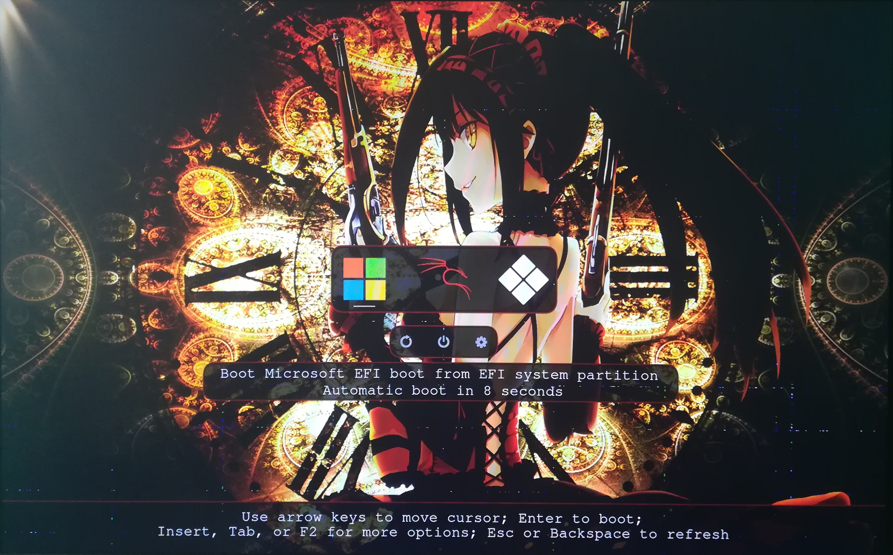

# Anime(Kurumi)  Theme
## A minimalistic rEFInd theme

### Usage

 1. Locate your refind EFI directory. This is commonly `/boot/EFI/refind`
    though it will depend on where you mount your ESP and where rEFInd is
    installed.

 2. Create a folder called `themes` inside it, if it doesn't already exist

 3. Clone this repository into the `themes` directory.

 4. To enable the theme add `include themes/rEFInd-kurumi/theme.conf` at the end of
    `refind.conf`, or change the default ``#include manual.conf``. 
    
 5. You may need to change the default resolution of the rEFInd menu (see refind.conf).

Entries should be autodetected and shown with the proper icons.

Manual entries can be done via `menuentry` option (see refind.conf for examples).

The background is designed to work with exactly 3 Icons, an maximum message lenth and 3
additional buttons. Other Configurations let the background look weird

### Attributions
> This theme is based on the [Sunset](https://gitlab.com/realmain/rEFInd-sunset) theme.

> Contains OS Icons from [munlik's](https://github.com/munlik/refind-theme-regular) repository.

> Forked from [Pr0cella](https://github.com/Pr0cella/rEFInd-glassy) repository.
